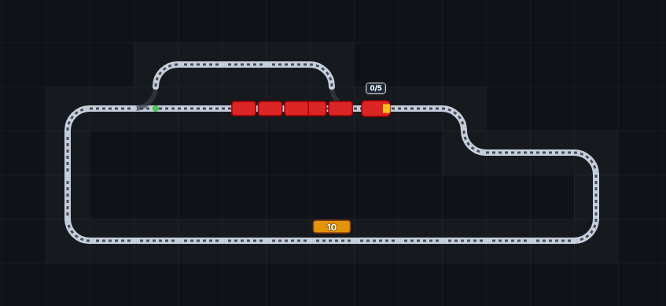

## Minirail

Minirail is inspired by my child's never-ending obsession with trains. I wanted a simple way for them to draw tracks and watch the trains zip around. 

### Features
**Stress-free** - No progression systems, or advanced management by design. Just a simple sandbox.

**Draw Mode** - Draw tracks and switches free-hand, no piece-by-piece placement.

**Simple Locos & Wagons** - Control multiple locomotives at once, set their speed, direction, and wagons.

**Stations & Switches** - Set points, and stations where trains will automatically collect and drop off passengers.

**(In Development) 3D View** - View your tracks in a 3D view as well. This mode is in early development.

### Contributing
Minirail is built with Sveltekit, and uses ShadCN for the UI and toolbar. You can run it very simply by cloning and running, no extra setup required.
`npm install`
`npm run dev`